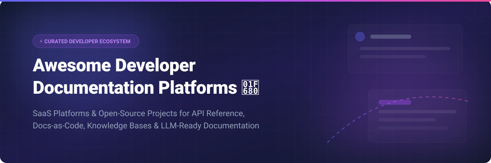

# 🚀 Awesome Developer Documentation Platforms

## 📚 Top Developer Documentation Platforms Ecosystem

> **Curated List of SaaS Products & Open-Source GitHub Projects**  
> *Focused on API Reference, Docs-as-Code, Knowledge Bases & LLM-Ready Documentation*  
> **Last updated: October 2026**

Welcome to the definitive awesome list for **Developer Documentation Platforms**! Whether you are looking for hosted SaaS tools or production-ready open-source doc generators, this curated guide covers solutions for interactive API references, docs-as-code workflows, technical wikis, and AI/LLM-optimized knowledge hubs.

---

## 📑 Table of Contents

- [☁️ SaaS & Hosted Documentation Platforms](#-saas--hosted-documentation-platforms)
- [🔓 Open-Source GitHub Projects](#-open-source-github-projects)
- [🤝 How to Contribute](#-how-to-contribute)
- [⚠️ Disclaimer](#-disclaimer)
- [💖 Support & Sponsorship](#-support--sponsorship)
- [📈 Star History](#-star-history)

---

## ☁️ SaaS & Hosted Documentation Platforms

> 💡 **Market Size & Industry Dynamics**: The global developer documentation and knowledge base software market is estimated at **$2.8 Billion - $3.5 Billion**, projected to grow rapidly with AI integration (`llms.txt`, MCP servers, AI agents). The sector is **moderately fragmented**, with category leaders like ReadMe, GitBook, and Document360 competing alongside fast-growing AI-native entrants like Mintlify and specialized tooling like Fern Docs and Redocly.

| Platform | Starting Tier Price | Free Tier / Trial Limit | Valuation / Revenue Estimate | Key Features & Focus |
| :--- | :--- | :--- | :--- | :--- |
| **[Document360](https://document360.com/)** | $149/project/month | 14-day free trial (no credit card required, full Pro feature access) | ~$20M ARR / Private (Kovai) | Enterprise knowledge base platform with versioning, RBAC, multi-language support, and analytics. |
| **[GitBook](https://www.gitbook.com/)** | $6.70/user/month | Free forever tier (up to 5 users, public docs, basic features) | $150M Valuation / ~$15M ARR | AI-native documentation with bi-directional Git sync, visual editor, automatic OpenAPI spec updates, and MCP analytics. |
| **[ReadMe](https://readme.com/)** | $99/project/month | Free forever tier (1 project, up to 3 API endpoints, community support) | ~$15M ARR / Private | Developer hub with bi-directional Git sync, top-ranked AI visibility score (85/100), and interactive API explorer with MCP read/write. |
| **[Mintlify](https://mintlify.com/)** | $120/month | Free forever tier (1 editor, basic MDX documentation hosting, community support) | $80M Valuation / ~$8M ARR | Zero-config MDX platform optimized for AI agents (`llms.txt`, MCP servers) with AI agent traffic analytics. |
| **[Redocly](https://redocly.com/)** | $300/month | Free trial available (14-day access to Redocly Portal & CLI tools) | ~$6M ARR / Private | CLI-first docs-as-code platform with OpenAPI linting, Redoc 3-panel renderer, and custom developer portals. |
| **[Stoplight](https://stoplight.io/)** | $99/month | Free forever tier (1 workspace, 1 design/doc project) | ~$5M - $10M ARR / Acquired by SmartBear | OpenAPI design-first platform featuring visual OpenAPI editor, spectral linting, mocking, and hosted API hubs. |
| **[Archbee](https://www.archbee.com/)** | $40/month | 14-day free trial (unlimited document creation during trial) | ~$3M ARR / Private | Block-based editor for product/API docs and internal team wikis with multi-domain hosting and API reference widgets. |
| **[Slab](https://slab.com/)** | $8/user/month | Free forever tier (up to 10 users, 90-day version history) | ~$2M - $5M ARR / Private | Modern team knowledge base with unified search across GitHub, Slack, and Google Drive. |
| **[Fern Docs](https://buildwithfern.com/)** | $150/month | Free forever tier (1 published doc site, OpenAPI generation) | Seed Stage (~$2M ARR) | Docs-as-code platform specialized in SDK generation from OpenAPI specs alongside beautiful documentation hosting. |

---

## 🔓 Open-Source GitHub Projects

Below is a curated collection of top open-source documentation frameworks, static site generators (docs-as-code), and self-hosted knowledge bases, sorted by GitHub star popularity.

### 🌟 Open-Source Options (Sorted by Star Count)

- **[Docusaurus](https://github.com/facebook/docusaurus)**   
  **The de facto standard open-source documentation framework (MIT, Meta/React).** Built on React and MDX. Features built-in versioning, i18n, Algolia DocSearch, and OpenAPI plugins. Best for complete control over technical documentation.

- **[MkDocs](https://github.com/mkdocs/mkdocs)**   
  **Fast, simple Python-based static site generator (BSD).** Highly extensible via plugins, with the popular **Material for MkDocs** theme providing modern responsive design and search.

- **[VitePress](https://github.com/vuejs/vitepress)**   
  **Vite & Vue-powered static site generator (MIT, Vue.js team).** High-performance doc engine designed for speed, lightweight builds, and seamless Vue integration.

- **[Wiki.js](https://github.com/requarks/wiki)**   
  **Modern, extensible Node.js wiki platform (AGPL-3.0).** Supports PostgreSQL, MySQL, and SQLite, with optional Git-backed storage committing every wiki edit to Git.

- **[BookStack](https://github.com/BookStackApp/BookStack)**   
  **Structured documentation platform (MIT, PHP).** Organizes content into an intuitive **shelf → book → chapter → page** hierarchy with Markdown and WYSIWYG support.

- **[Astro Starlight](https://github.com/withastro/starlight)**   
  **Official documentation framework for Astro (MIT).** Ultra-fast, zero-JS by default, accessible, featuring built-in site search, i18n, and custom MDX components.

- **[Hugo DocDock / ReLearn](https://github.com/gohugoio/hugo)**   
  **Blazing-fast Go static site generator (Apache 2.0).** Powers massive doc portals with millisecond build times and markdown flexibility.

- **[Docmost](https://github.com/docmost/docmost)**   
  **Open-source Confluence/Notion alternative (AGPL-3.0).** Features real-time collaborative editing (CRDTs), nested workspaces, granular permissions, and native diagrams (Mermaid, Draw.io).

- **[Parabol Pages](https://github.com/ParabolInc/parabol)**   
  **Open-source knowledge base integrated with meeting workflows (AGPL-3.0).** Converts retro and planning meeting outputs into structured documentation with AI summaries.

- **[PandaWiki](https://github.com/chaitin/PandaWiki)**   
  **LLM-native knowledge base by Chaitin (Open-Source).** Multi-source ingestion with vector indexing and RAG pipelines for semantic search over documentation.

- **[Alexandrie](https://github.com/Smaug6739/Alexandrie)**   
  **Offline-first PWA knowledge base (Open-Source).** Features extended Markdown with LaTeX, OIDC/SSO authentication, multi-tenant teams, and S3 storage compatibility.

- **[LibreKB](https://github.com/michaelstaake/LibreKB)**   
  **Lightweight self-hosted PHP/MySQL knowledge base (Open-Source).** Simple setup with TinyMCE editor, user permissions, and responsive Bootstrap layout.

---

## 🤝 How to Contribute

1. 🍴 Fork the repository.
2. 📝 Add or update entries in `README.md` following the established table/list formatting.
3. ℹ️ Include name, URL, exact pricing details, star counts, and clear descriptions.
4. 🔀 Submit a Pull Request with a brief explanation.

---

## ⚠️ Disclaimer

- This is a **community-curated list** — not exhaustive and not an official endorsement of any listed product.
- **Open-Source vs. SaaS Consideration**: Open-source frameworks like **Docusaurus**, **VitePress**, **Wiki.js**, and **BookStack** offer complete data sovereignty and zero licensing fees. Hosted commercial platforms (Mintlify, ReadMe, GitBook) provide zero-config AI agent preparation (`llms.txt`, MCP servers) and managed infrastructure.

---

## 💖 Support & Sponsorship

If you find this repository helpful, please consider supporting the project:

- ⭐ **Star** this repository to increase its visibility!
- 🔀 **Fork** and contribute new platforms or updates.
- 📢 **Share** with technical writers, devrel engineers, and developer teams.
- ☕ **Buy Me a Coffee**: Support ongoing maintenance via the [GitHub Sponsor Dashboard](https://github.com/sponsors/ishandutta2007).

Thank you for being part of the developer documentation community! 💖

---

## 📈 Star History

---

**Made with ❤️ for technical writers, Developer Relations (DevRel) teams, API Product Managers, and Documentation Engineers.**
